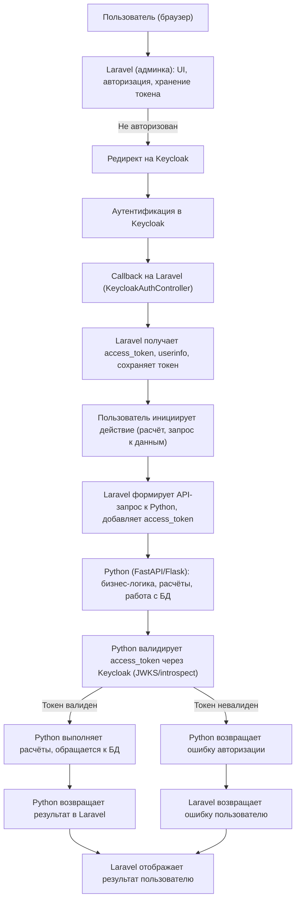

# Описание архитектуры: Laravel (админка, авторизация) + Python (МС Расчётов)

## 1. Общая идея

- **Laravel** реализует административную панель, авторизацию пользователей, хранение токена, UI для настройки расчётов, коэффициентов, тарифных таблиц и логирования.
- **Python** реализует микросервис расчётов: принимает входные данные, выбирает коэффициенты, применяет формулы, возвращает результат.

---

## 2. Этапы работы системы

### 2.1. Авторизация и доступ к админке
- Пользователь заходит в админку (Laravel).
- Laravel проверяет авторизацию через Keycloak (или другой провайдер).
- После успешной авторизации access_token сохраняется в сессии пользователя.

**Пример:**
Пользователь открывает `/admin/calc-templates` — Laravel проверяет токен, если не авторизован, редиректит на Keycloak.

### 2.2. Управление шаблонами расчётов, коэффициентами, тарифными таблицами
- Вся настройка (CRUD шаблонов, коэффициентов, тарифных таблиц) происходит через UI Laravel.
- Laravel хранит эти данные в своей БД (или синхронизирует с Python через API, если нужно).

**Пример:**
Администратор добавляет новый шаблон расчёта через форму в админке Laravel. Laravel сохраняет шаблон в БД и (опционально) отправляет обновление в Python-сервис.

### 2.3. Запуск расчёта
- Пользователь (или другой сервис) инициирует расчёт через UI или API Laravel.
- Laravel формирует JSON с входными данными и access_token.
- Laravel отправляет запрос в Python-сервис (например, POST `/api/calculate`).

**Пример запроса:**
```json
{
  "template_id": 1,
  "input": {
    "age": 30,
    "region": "Moscow",
    "vehicle_type": "car"
  }
}
```
**HTTP-заголовок:**
```
Authorization: Bearer <access_token>
```

### 2.4. Выполнение расчёта в Python
- Python-сервис принимает запрос, валидирует access_token через Keycloak (JWKS/introspect).
- Находит нужный шаблон, выбирает коэффициенты из тарифных таблиц по входным данным.
- Применяет формулу, рассчитывает результат.
- Возвращает результат в виде JSON.

**Пример ответа:**
```json
{
  "result": 12345.67,
  "details": {
    "used_coefficients": {
      "age": 1.2,
      "region": 1.1,
      "vehicle_type": 1.3
    },
    "formula": "base * age_coeff * region_coeff * vehicle_type_coeff"
  }
}
```

### 2.5. Отображение результата и логирование
- Laravel получает ответ от Python, отображает результат пользователю.
- Laravel логирует расчёт: входные данные, коэффициенты, результат, пользователя.
- Вся история доступна в админке (поиск, фильтрация, просмотр деталей).

### 2.6. Управление пользователями и ролями
- Управление пользователями, ролями и правами доступа реализовано в Laravel (через Keycloak или встроенные механизмы).
- Роли: Администратор, андеррайтер, пользователь.
- Доступ к разделам админки и функциям ограничивается ролями.

### 2.7. Импорт/экспорт тарифных таблиц
- Импорт/экспорт реализован в Laravel: пользователь загружает/выгружает файлы через UI.
- Laravel парсит/сохраняет данные, (опционально) синхронизирует с Python.

---

## 3. Примеры сценариев

### Пример 1: Администратор настраивает новый шаблон расчёта
1. Входит в админку (авторизация через Keycloak).
2. Открывает раздел "Шаблоны расчётов".
3. Создаёт новый шаблон, настраивает формулу, сохраняет.
4. Добавляет тарифную таблицу, импортирует коэффициенты.
5. Всё хранится в БД Laravel.

### Пример 2: Пользователь запускает расчёт
1. Входит в админку.
2. Открывает форму расчёта, выбирает шаблон, вводит входные данные.
3. Laravel отправляет запрос в Python-сервис.
4. Python рассчитывает результат, возвращает его.
5. Laravel показывает результат, логирует операцию.

### Пример 3: Интеграция с МС Полисов
- После расчёта Laravel (или Python) отправляет информацию о расчёте в МС Полисов через API.

---

## 4. Пример API Python-сервиса

**POST /api/calculate**
```json
{
  "template_id": 2,
  "input": {
    "age": 45,
    "region": "Krasnodar",
    "vehicle_type": "truck"
  }
}
```
**Ответ:**
```json
{
  "result": 23456.78,
  "details": {
    "used_coefficients": {
      "age": 1.5,
      "region": 1.2,
      "vehicle_type": 1.4
    },
    "formula": "base * age_coeff * region_coeff * vehicle_type_coeff"
  }
}
```

---

## 5. Безопасность
- Все запросы к Python-сервису защищены access_token.
- Python валидирует токен через Keycloak.
- Доступ к расчётам и настройкам — только у авторизованных пользователей с нужной ролью.

---

## 6. Логирование и аудит
- Laravel логирует все действия: изменения коэффициентов, запуск расчётов, импорт/экспорт, действия пользователей.
- История доступна для поиска и анализа.

---

## 7. Преимущества такой архитектуры
- Гибкость: можно менять расчётные формулы и коэффициенты без изменения кода Python.
- Масштабируемость: Python-сервис можно масштабировать независимо.
- Безопасность: централизованная авторизация и аудит.
- Удобство: вся настройка и история — в единой админке.

---

# Блок-схема архитектуры (Laravel + Python)


