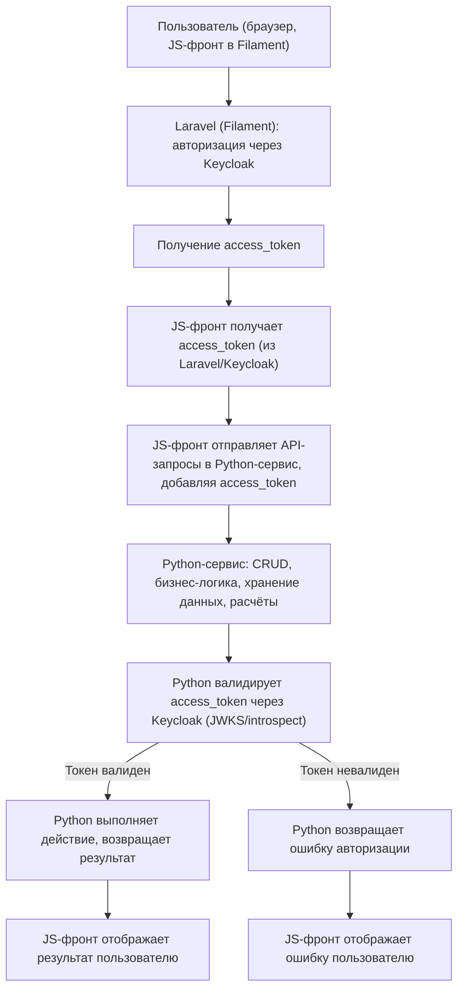

# Архитектура: Python-сервис реализует API админки, фронт на JS внутри Filament

> **Комментарий менеджера проекта:**
> "Питовский сервис реализует api админки. И некий фронт (фрейм на js внутри филамента) его использует."

---

## 1. Общая идея

- **Python-сервис** реализует весь API для админки: CRUD, бизнес-логику, хранение данных, расчёты, историю, справочники.
- **Фронт** — это JS-приложение (SPA или виджет), встроенное как фрейм (iframe или модуль) в Filament (Laravel).
- **Laravel (Filament)** отвечает только за авторизацию пользователя через Keycloak и интеграцию с фронтом.
- **Keycloak** — единая точка авторизации для всех участников.

---

## 2. Флоу работы системы

1. Пользователь заходит в админку (Filament/Laravel).
2. Проходит авторизацию через Keycloak (сквозная авторизация).
3. После авторизации получает access_token (через cookie, localStorage или проксирование).
4. JS-фронт (внутри Filament) использует access_token для работы с Python API.
5. Все CRUD-операции, расчёты, история, справочники — только в Python-сервисе.
6. Python-сервис валидирует access_token через Keycloak.
7. JS-фронт отображает результаты и ошибки пользователю.

---

## 3. Блок-схема архитектуры

---

## 4. Ключевые моменты

- **Единая точка правды** — Python-сервис (все CRUD, справочники, история, расчёты).
- **Laravel** — только авторизация, интеграция с Keycloak, возможно, проксирование токена.
- **Фронт** (JS, внутри Filament) — UI, работает напрямую с Python API, используя access_token.
- **Keycloak** — сквозная авторизация для всех участников.
- **Вся логика отображения, ошибок, UX — на стороне JS-фронта.**

---

## 5. Пример флоу

1. Пользователь заходит в админку (Filament/Laravel).
2. Проходит авторизацию через Keycloak.
3. Получает access_token.
4. JS-фронт (внутри Filament или как отдельный SPA) использует access_token для работы с Python API.
5. Все CRUD-операции, расчёты, история — только в Python.
6. Python валидирует токен через Keycloak.
7. JS-фронт отображает результат или ошибку пользователю.

---

## 6. Особенности и преимущества

- **Backend (Python)** — единая точка правды, вся бизнес-логика и данные.
- **Frontend (JS)** — гибкий, легко обновлять UI без изменений backend.
- **Laravel** — только авторизация, интеграция с Keycloak, не хранит бизнес-данные.
- **Масштабируемость:** backend и frontend развиваются независимо.
- **Безопасность:** сквозная авторизация через Keycloak, все запросы к Python API защищены access_token.

---

Документ отражает современный подход: Python-сервис реализует API админки, фронт на JS внутри Filament использует этот API, а Laravel отвечает только за авторизацию через Keycloak. 
